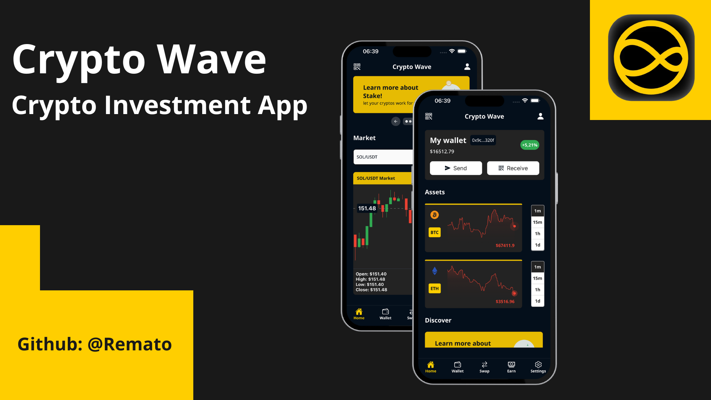
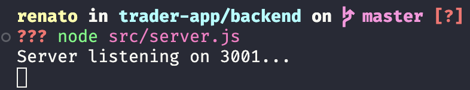
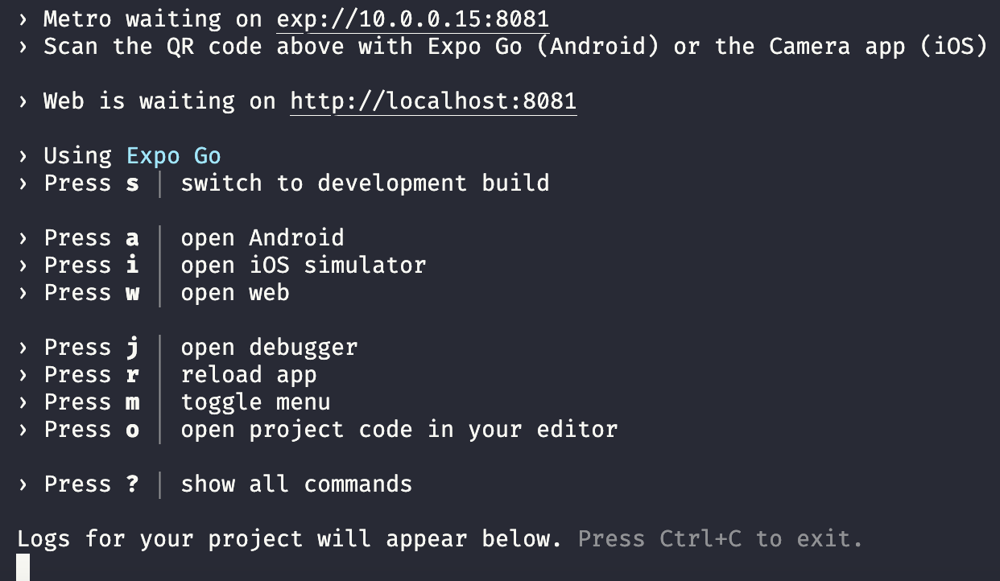

<h1 align="center"> Crypto Investment App </h1>

<p align="center">This project was created as a demonstration of my skills</p><br/>

<p align="center">
  <a href="#-technologies">Technologies</a>&nbsp;&nbsp;&nbsp;|&nbsp;&nbsp;&nbsp;
  <a href="#-project">Project</a>&nbsp;&nbsp;&nbsp;|&nbsp;&nbsp;&nbsp;
  <a href="#-execution">Execution</a>&nbsp;&nbsp;&nbsp;|&nbsp;&nbsp;&nbsp;
  <a href="#-demo">Demo</a>&nbsp;&nbsp;&nbsp;&nbsp;&nbsp;&nbsp;

</p>

<br>

<p align="center">
  
</p>

## 🚀 Technologies

This project was developed using the following technologies and standards:

- [Expo](https://expo.dev/)
- [React Native](https://reactnative.dev/)
- [Typescript](https://www.typescriptlang.org/)
- [Zustand](https://github.com/pmndrs/zustand)
- [React Reanimated 2x](https://github.com/software-mansion/react-native-reanimated)
- [React Native Animatable](https://github.com/oblador/react-native-animatable)
- [Websockets](https://github.com/robtaussig/react-use-websocket)
- [React Native Wagmi Charts](https://github.com/coinjar/react-native-wagmi-charts)

## 💻 Project

this project was inspired by the layout of the Nomad Global app [Nomad](https://www.nomadglobal.com/en) and by Binance Exchange [Binance](https://www.binance.com/en)

## 💬 Explanation

This application has been divided into 2 folders `backend` and `frontend`

  - Backend
    - It is a simple `Node.js` server that calls the `Binance public API` and serves on a local address on port 3001.

  - Frontend
    - It is a `React Native` application built using the `Expo SDK 50`, consumes the backend API and has connections to `Binance Websockets` to update the charts in `real time`

## 🏆 Challenges

Perhaps the hardest part was making the Binance API available online so that the Android installation file could be made available.

- Binance API cannot run on US clients, servers generally default to North American servers

- I needed to change the server region to Asia so that there would be no problem with the API

## ⚙️ Execution


1 - Install dependencies and run the backend.
```sh
cd backend && yarn && node src/server.js
```

you will see something similar to this:


2 - Now you need to run the frontend
```sh
cd frontend && yarn && yarn start
```

you will see something similar to this:



3 - You can simulate on your own iOS or Android device by installing Expo Go on your device

[Google Play](https://play.google.com/store/apps/details?id=host.exp.exponent&hl=en&pli=1)
or
[Play Store](https://apps.apple.com/br/app/expo-go/id982107779) 

**[Optional]** 

If you have a simulator on your macbook or notebook you can simply `press "a"` to simulate Android or `press "i"` to simulate iOS

## 🖥 Demo

You  can see a previews here

https://github.com/Remato/crypto-trader-app/assets/8043534/9ddabb24-6e83-47b2-af98-8b3e33ce96cf
  
https://github.com/Remato/crypto-trader-app/assets/8043534/dab2d2f2-9c89-4eaa-9795-d8b688894ab0

https://github.com/Remato/crypto-trader-app/assets/8043534/152ed701-030b-48ee-b792-49a79a2c11ee

https://github.com/Remato/crypto-trader-app/assets/8043534/8d860e79-e79b-43ed-a557-3e7d587895b4

https://github.com/Remato/crypto-trader-app/assets/8043534/32e3b7ca-819b-43bb-845a-c82b908a649c

---


